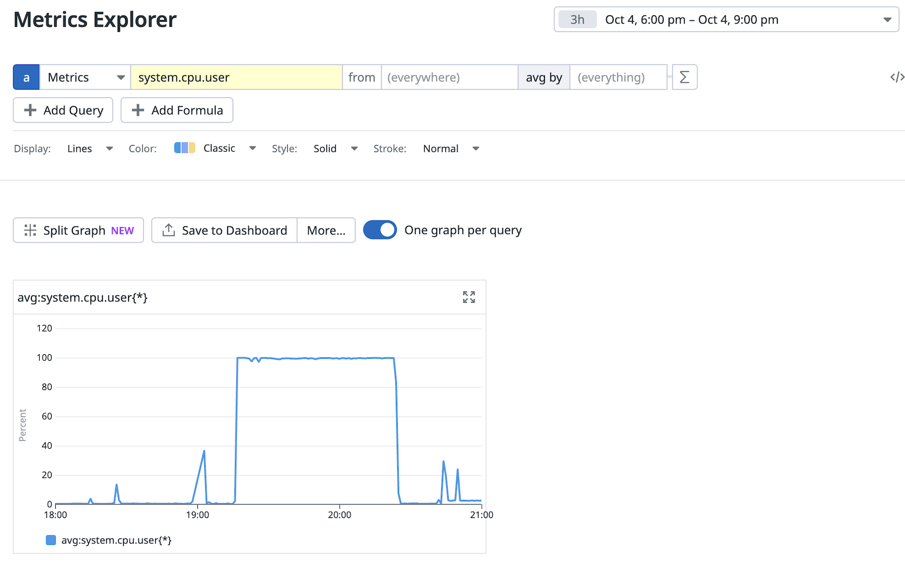
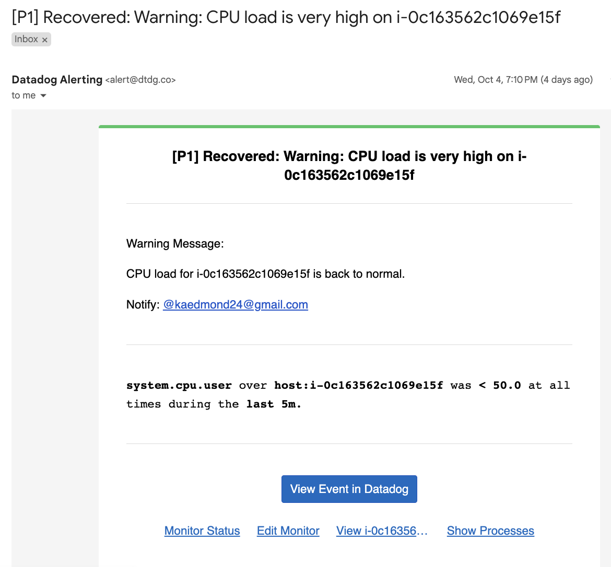

# Purpose:

Test URL Shortening application ([deployment 4](https://github.com/kaedmond24/python_url_shortener_deployment_4)) and infrastructure’s ability to handle increasing workloads internally (running high CPU processes) and externally (10000+ web requests).

Blitz 2 uses Apache JMeter to flood the python URL Shortening application with 14000 web requests along with running CPU-intensive processes. This testing measure helps us determine how well the application and infrastructure would perform under heavy traffic.

# Summary:

1. Summary of the QA's activities.

   - On October 4, 2023, the QA engineer ran a load test on the [URL Shortener application](https://github.com/kaedmond24/python_url_shortener_deployment_4). During the test 14000 GET requests were sent to the application’s web address. Out of the 14000 requests sent 4343 of the requests were unable to access the application. Moreover, server CPU resources were being utilized by the QA engineers running blitz.sh process. As a result, the server’s CPU utilization remained at 100% for an extended period of time severely degrading productivity.

2. What steps were taken to remediation the issue (if there were any).

   - Several steps were taken in order to remediate this issue. To start, monitoring email notifications and metrics monitoring from Datadog were reviewed to get a time frame of the increased CPU utilization. Next, a review of the servers running processes for the time period in-question was completed. This led to the discovery of the running blitz.sh process and its impact on the CPU. The QA engineer followed to inform us of the load test which took place while the blitz.sh was running. The combination of the blitz.sh process, nginx application handling increasing web request, and the running URL Shortener application proved too much for current server deployment, T2 medium (2 vCPU, 4 GiB Mem). In order to resolve the issue of resource utilization the EC2 instance will be vertically scaled to a T2 2xlarge (8vCPU, 32 GiB Mem). With 4x more computing power handling an increased load matching the QA engineer’s testing parameters and more should be comfortably within the server’s limit.

   > Datadog Metric Monitoring
   >   

   > Datadog Monitoring Alert
   >   

3. What was the value of the test results before and after.

   - Prior to QA testing, the previous server was able to easily handle the server load without any substantial web requests being serviced. However, load testing the server uncovered some major flaws in usability of the web server when other processes on the server had increased CPU utilization. Results for the updated QA testing using the new instance build is TBD.
